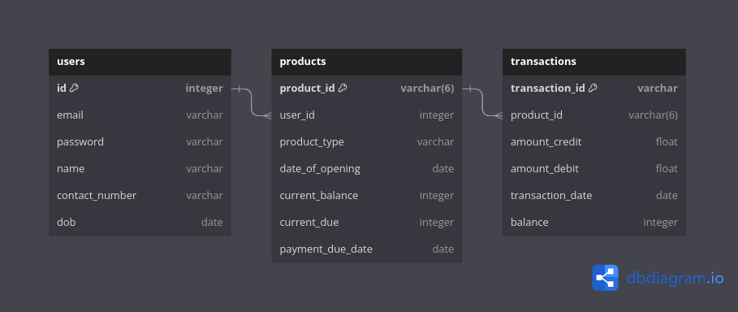

# Plivo Hackathon Submission

### Repository: https://github.com/kasheravaibhav14/plivo_hackathon.git
### Name: Vaibhav Kashera
### E-mail: kasheravaibhav14@gmail.com

### Loom video URL: https://www.loom.com/share/a58de75333fe4f08a1a42d9e86621221?sid=b3c17f8a-3fa3-4d84-acab-d53c1eaf92f5

## Quick Brief:

- The product I have built is a dummy banking application.
- The main highlight is the real-time notification enabled using Plivo SMS API, and enabling multiple banking features using this API.
- A special feature of the application is its ability to provide real time encrypted PDF statements of the requested account via SMS. The PDF is shared as a presigned downloadable URL using Amazon S3. 
- I also attempted two-way communication using the SMS API to enable banking over SMS. However, I later discovered that Two-way SMS is unavailable in India due to certain factors.
- I will walk you through the features one by one.

## Framework
The application is built in Python3 using Flask, SQLAlchemy, and, of course, Plivo API as its main drivers.

## Setup and installations

Please use the following commands to setup and run the application. Please populate the API keys/token as they have not been pushed to this repository.

Note: Proper policy needs to be set-up on the AWS S3 bucket in order to run the application.
```bash
    python3 -m venv my-venv
    source my-venv/bin/activate
    
    export PLIVO_AUTH_ID=..
    export PLIVO_AUTH_TOKEN=..

    export FLASK_SECRET_KEY=my-secret-flask-123
    export FLASK_APP=plivo_hackathon
    export FLASK_DEBUG=1

    export AWS_ACCESS_ID=..
    export AWS_SECRET_ACCESS_KEY=..

    export AWS_REGION=..
    export S3_BUCKET=..
```
We can rent a Number from Plivo Numbers API to use it to send SMS. It must be exported here as well, so that the SMS is sent using the rented number 

```bash

    export PLIVO_NUM=..
    git clone https://github.com/kasheravaibhav14/plivo_hackathon.git
    pip3 install -r plivo_hackathon/requirements.txt
    flask run
```

## Features:

- **Authentication:**
  - Authentication is implemented using flask-login, which maintains the authentication state. Certain routes are protected with `@login_required` decorator.
  - Both signup and login are available. However, for demonstration purposes, an existing credential with pre-populated accounts and transactions is provided.
  
- **Hidden Endpoints (F0):**
  - Internal endpoints are available to perform updates on bank accounts/credit cards, enabling transactions outside the application (in real life banks).
  - This feature is designed to prevent direct user interference with transactions.
  - Functions include account creation and any payment deposits/debits processed by the bank.
  - Each transaction triggers a notification to the end user.

- **View Transactions (F1):**
  - Users can select an account to view transactions.
  - Option to request a PDF of a specific number of transactions over SMS.
  - The PDF is generated at the backend and encrypted using the user’s date of birth.
  - It is then uploaded to an AWS S3 bucket using the boto3 client, and an SMS with a pre-signed direct downloadable link is sent to the user’s registered mobile number.

- **Credit Card Bill Payment (F2):**
  - Users with a credit card can pay their bill using their savings bank account, provided the bill amount is less than or equal to the bank balance.
  - This action is executed as an instance of the hidden endpoint, triggering SMS notifications to the customer for both bill payment on the credit card and amount debit on the bank account, mimicking real-life scenarios.

## Database design

This section outlines the database design for the dummy banking application, highlighting the key models and their relationships.

### User Model

The `User` model represents a user in the application and maintains a relationship with the `Product` table.

### Product Model

The `Product` model represents a product in the application and maintains a relationship with the `User` and `Transactions` tables.

### Transactions Model

The `Transactions` model represents a transaction in the application and maintains a relationship with the `Product` table.

### Relationships

- **User - Product:** One-to-many relationship. Each user can have multiple products.
- **Product - Transactions:** One-to-many relationship. Each product can have multiple transactions.


The database design effectively manages users, products, and transactions. Users can have multiple products, and each product can have multiple transactions. This design supports efficient data management and retrieval for the application's functionality.

For a detailed visual representation of the database schema, refer to the provided database diagram:




## Project File Description:

### Folder Structure:

- **templates:**
  - `base.html`: Base HTML template.
  - `index.html`: HTML template for the main application page.
  - `login.html`: HTML template for the login page.
  - `pay_credit_card.html`: HTML template for the credit card bill payment page.
  - `signup.html`: HTML template for the signup page.
  - `transactions.html`: HTML template for viewing transactions.
- `helper_populate_transactions.py`: Python script for populating transactions.
- `__init__.py`: Initialization file for the Python package.
- `main.py`: Main application logic and routes.
- `auth.py`: Routes for authentication(login and signup).
- `models.py`: File containing models for the application (e.g., User model).
- `plivo_utils.py`: Utility functions related to Plivo SMS API.
- `README.md`: Project's README file.
- `requirements.txt`: File listing required Python packages and versions.

  
The `__init__.py` file initializes the Flask application and sets up the necessary configurations, including the database connection and login management. It registers blueprints for authentication and main application routes. The `create_app()` function creates and configures the Flask application.

### `auth.py`:

This file contains the authentication-related routes and functions for user login, signup, and logout. It utilizes Flask's Blueprint to define routes for handling authentication processes. Routes include login page display, login handling, signup page display, signup handling, and logout.

### `models.py`:

Defines the data models for the application using SQLAlchemy. Includes models for `User`, `Product`, and `Transactions`. Describes the attributes and relationships for each model, such as user details, products, and transactions.

### `plivo_utils.py`:

Contains utility functions for interacting with the Plivo SMS API. Defines functions to send SMS messages and create a Plivo REST client. Provides functions like `send_sms` and `get_client` for sending SMS messages and initializing the Plivo REST client.

### `main.py` File Description:

`main.py` is a file containing the main application logic and routes for the dummy banking application. It utilizes Flask, a micro web framework in Python, to handle HTTP requests and responses. The file implements various routes to manage user authentication, product management, transactions, PDF creation, and SMS notifications.


- **Routes and Functionality:**
  - `index()`: Renders the main application page (`index.html`).
  - `add_product()`: Adds a new product (credit card or savings account) based on provided data.
  - `get_products()`: Retrieves all products associated with the logged-in user.
  - `add_transaction()`: Adds a new transaction for the provided product-id associated with the user.
  - `get_transactions()`: Retrieves transactions for a specified product.
  - `create_pdf()`: Creates a PDF document containing transaction data.
  - `transactions()`: Handles viewing transactions for a user's products.
  - `pay_credit_card()`: Handles the process of paying a credit card bill using a bank account.
  - `create_and_send_pdf()`: Creates a PDF from transaction data and sends it via SMS.
  - `inbound_sms()`: Handles inbound SMS messages. Not tested due to unavalibility of resources

- **SMS Notifications:**
  - Integrates with the Plivo API to send SMS notifications for various transactions and PDF statements.

- **Error Handling:**
  - Implements error handling for various scenarios such as invalid JSON data, database errors, insufficient balance, and more.

- **PDF Generation and Upload:**
  - Uses the `reportlab` library to generate PDF documents from transaction data, encrypted with User Date of Birth for security.
  - Utilizes `boto3` to upload the generated PDF to an Amazon S3 bucket.

- **Amazon S3 Integration:**
  - Utilizes `boto3` to upload the generated PDF to an Amazon S3 bucket.

